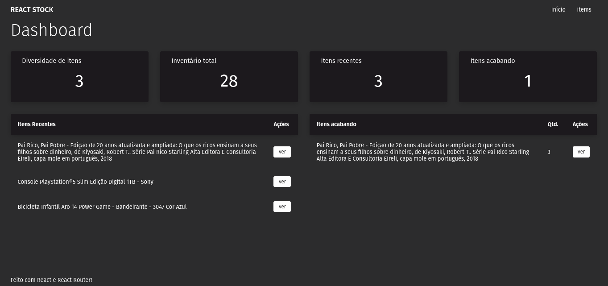

# REACT-STOCK

https://react-stock-ten.vercel.app/

Essa aplicação foi desenvolvida durante o curso Full Stack JavaScript da onebitcode utilizando React, react-dom, react-router-dom, JavaScript e CSS.

## Executando

Após clonar o repositório, acesse a pasta do projeto e execute os comandos abaixo:

```sh
npm install
npm run dev
```

Acesse http://localhost:5173 para visualizar a aplicação.
